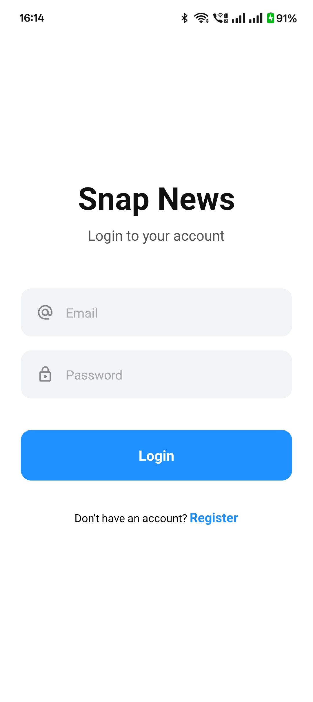
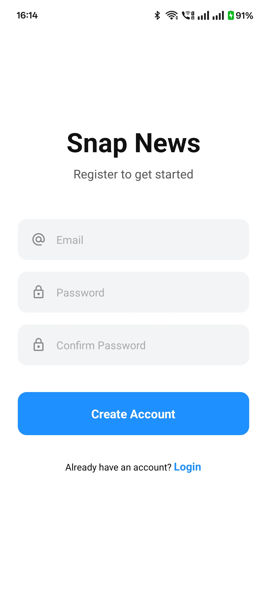
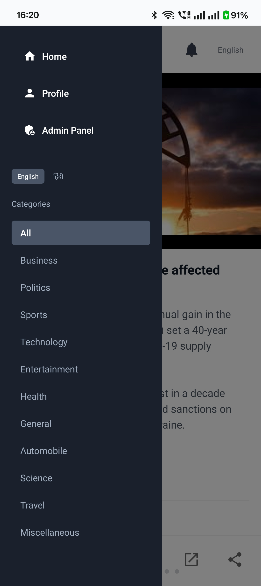
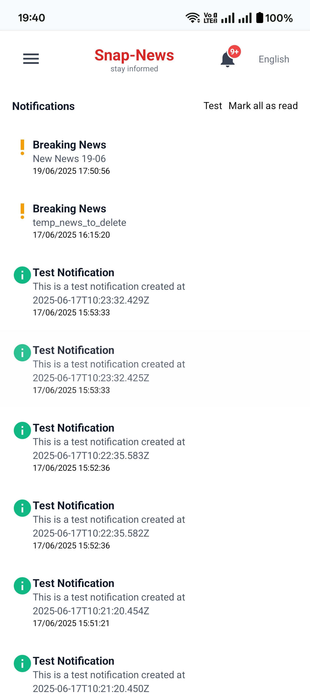
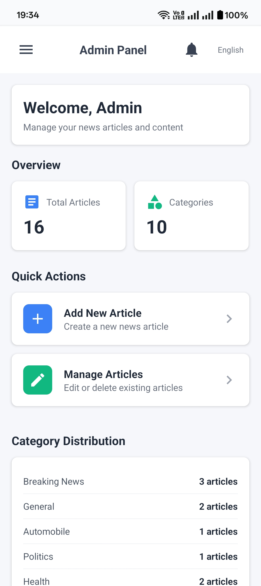
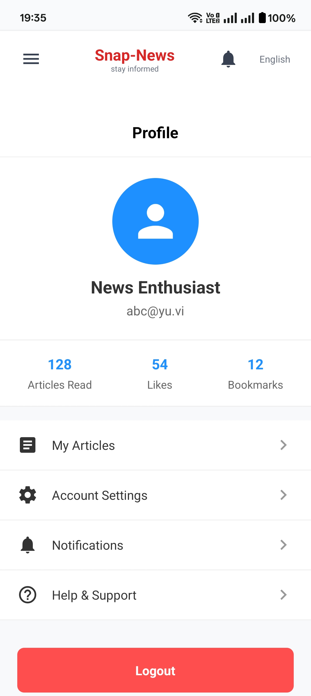

# 📱 Snap News – Mobile News Summary App

A sleek mobile app that delivers concise news summaries across various categories in a scrollable, card-based layout. Built with **React Native + Expo** for a fast and intuitive user experience.


## 🚀 Features

- 📰 Scrollable card-based news feed
- 🎯 Filter by categories (Technology, Sports, Business, etc.)
- 🔒 Firebase Authentication (Login/Register)
- ⚙️ Admin Panel (for content management)
- 🧾 Profile & Notification pages
- 🌙 Clean UI powered by TailwindCSS and NativeWind

---

## ⚙️ Tech Stack

- **React Native (Expo)**
- **Firebase Authentication**
- **TailwindCSS + NativeWind**
- **TypeScript**
- **React Navigation**
- **React Native Safe Area Context**

---

## 🛠️ Project Setup

### Step-by-step Setup Guide:

#### 🔧 Initialization

```bash
npx create-expo-app@latest ./
npm run reset-project
```


🌀 Styling with TailwindCSS + NativeWind
```bash
npm install nativewind tailwindcss react-native-safe-area-context
npx tailwindcss init
```

## 🛠 NativeWind Setup ([Guide](https://www.nativewind.dev/quick-starts/expo))

#🔐 Firebase Authentication Setup
Install dependencies:
```bash
npx expo install @react-native-firebase/app @react-native-firebase/auth
```

Follow the official Firebase setup ([guide](https://rnfirebase.io/auth/usage)) to configure it properly in your project
```
#▶️ Running the App (Android)
Step-by-step:
1. Install build props support:
```bash
npx expo install expo-build-properties
```

2. Navigate to the Android folder:

```bash
cd android
```

3. Create a local.properties file inside /android with the following content:

```bash
sdk.dir = C:\\Users\\YourUsername\\AppData\\Local\\Android\\Sdk
```

4. Generate signing report:

```bash
gradlew signingReport
```

5. Run the Android app:

```bash
npx expo run:android
```

or 

For iOS (on macOS):
```bash
npx expo run:ios
```


## 🖼️ Screenshots

| Screen                   | Preview                                                                 |
|--------------------------|-------------------------------------------------------------------------|
| 🔐 Login Page            |  |
| 📝 Register Page         |  |
| 🏠 Home Page             |  |
| 📚 Sidebar               |  |
| 🔔 Notifications         |  |
| 🛠 Admin Panel (Home)    |  |
| 🛠 Admin Panel (Manage)  |  |
| 👤 Profile Page          |  |


